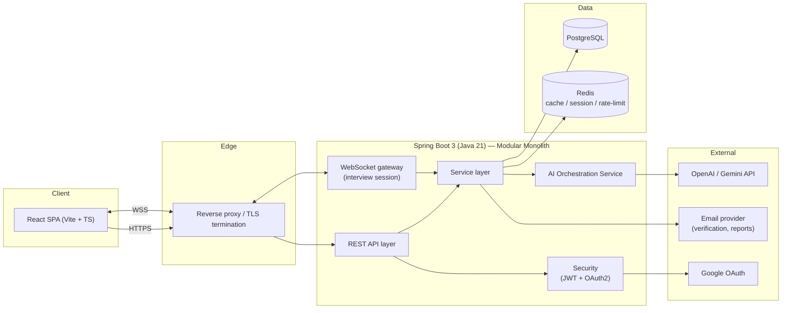
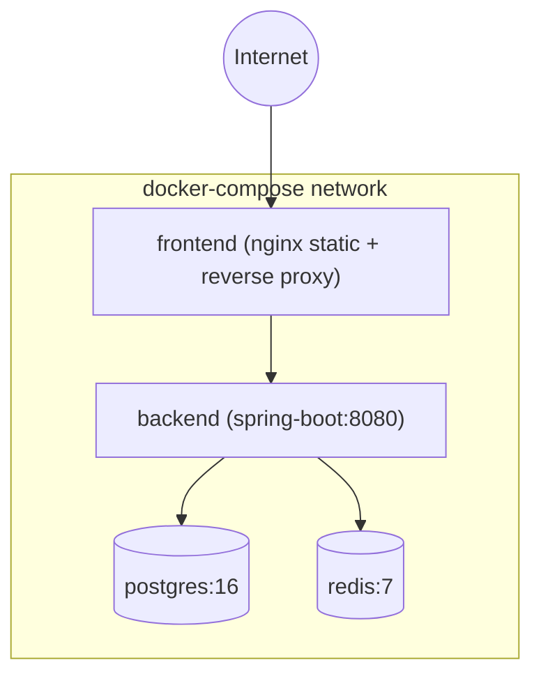
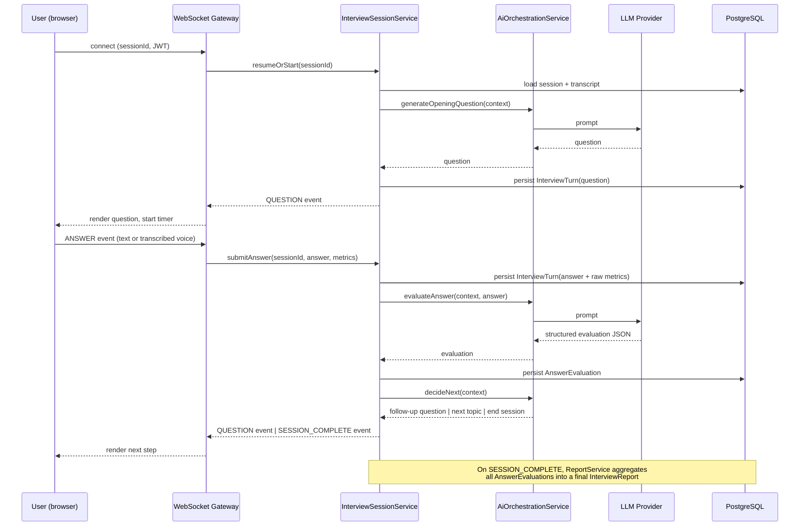

# InterviewIQ AI — System Architecture

> Practice Smarter. Interview Better.

This document defines the system-level architecture for InterviewIQ AI. It is
the reference all later phases (DB schema, API design, backend/frontend
implementation) are built against. Nothing here should be re-litigated
per-feature — if a feature needs to deviate from this doc, update this doc
first.

## 1. High-level system



**Why a modular monolith, not microservices.** At this stage a single Spring
Boot deployable with strict internal module boundaries (see §3) gives us
transactional integrity around interview sessions, much simpler local dev and
deployment, and no premature network-boundary tax. Module boundaries are
drawn so that extraction into services later (e.g. the AI orchestration
module, or resume parsing) is a lift-and-shift, not a rewrite. This is the
same pragmatic path Stripe and Linear took early on — don't design for scale
you don't have yet, but don't paint yourself into a corner either.

## 2. Deployment topology (Docker Compose, local/staging)



Production target (documented for later, not built yet): container images
pushed to a registry, deployed behind a managed load balancer, PostgreSQL and
Redis as managed services, horizontal scaling of the backend behind sticky
sessions only for the WebSocket interview gateway (or a Redis-backed session
store to avoid stickiness entirely — preferred).

## 3. Backend module boundaries

Package root: `com.interviewiq`

```
com.interviewiq
├── config/              # Spring config: security, CORS, OpenAPI, Redis, WebSocket, async, profiles
├── common/               # Cross-cutting: exceptions, base entities, pagination, audit fields
├── auth/                 # Registration, login, JWT, refresh tokens, OAuth2, email verification, 2FA
├── user/                 # Profile, preferences, settings
├── resume/               # Upload, parsing, AI resume analysis, ATS scoring
├── interview/             # Session lifecycle, question flow, WebSocket handlers, transcripts
├── evaluation/            # Per-answer AI evaluation, scoring rubrics, aggregate report generation
├── coding/                # Coding round: Monaco submissions, execution sandbox, test cases
├── systemdesign/          # System design round: diagram submission + AI review
├── ai/                    # LLM client abstraction, prompt templates, provider adapters (OpenAI/Gemini)
├── analytics/             # Streaks, trends, aggregation queries for dashboard/analytics
├── learning/              # Learning Hub recommendations
├── notification/          # Email + in-app notifications
├── admin/                 # Admin panel endpoints (user mgmt, API usage, feature flags)
└── report/                # PDF report generation
```

Each feature package follows the same internal layering:

```
<feature>/
├── controller/    # @RestController — thin, maps DTO <-> service calls, no business logic
├── service/       # Business logic, transactional boundaries (interfaces + impl)
├── repository/    # Spring Data JPA repositories
├── entity/        # JPA entities (persistence model, never returned from controllers)
├── dto/           # Request/response DTOs (validation annotations live here)
├── mapper/        # Entity <-> DTO mapping (MapStruct)
└── exception/     # Feature-specific exceptions, caught by GlobalExceptionHandler
```

Rules:
- Controllers never see entities. Services never see DTOs from other features
  directly — cross-feature calls go through the other feature's service
  interface.
- All persistence access goes through a repository; no `EntityManager` in
  services except where a feature genuinely needs a native/JPQL query.
- `ai/` is the only package allowed to call external LLM providers. Every
  other feature that needs AI capability depends on `ai/`'s public interface
  (`AiOrchestrationService`), never on an HTTP client directly. This is what
  makes swapping OpenAI ↔ Gemini, or adding a fallback provider, a one-file
  change.

## 4. Frontend module boundaries

```
frontend/src
├── app/                 # App shell: router, providers, layout, error boundaries
├── features/            # Feature-sliced, mirrors backend features
│   ├── auth/
│   ├── dashboard/
│   ├── resume/
│   ├── interview/
│   │   ├── setup/       # role/company/difficulty picker
│   │   ├── session/     # live interview UI (voice/text, question flow)
│   │   ├── coding/      # Monaco round
│   │   └── system-design/
│   ├── report/
│   ├── analytics/
│   ├── learning-hub/
│   ├── profile/
│   └── admin/
├── components/          # Shared design-system components (shadcn-based)
├── hooks/                # Shared hooks
├── lib/                  # api client (axios + interceptors), query client, ws client, utils
├── stores/                # Client state (auth session, theme, command palette)
├── types/                 # Shared TS types / generated API types
└── styles/                 # Tailwind config, design tokens
```

Each `features/<x>` folder is self-contained: its own `api.ts` (React Query
hooks), `components/`, and `types.ts`. Features do not import each other's
internals — only `components/`, `lib/`, `hooks/` are shared.

## 5. The interview session — core data flow

This is the heart of the product, so it gets its own walkthrough.



Key decisions:
- The WebSocket carries the live turn-by-turn exchange; plain REST handles
  session setup (role/company/difficulty selection) and report retrieval
  after the fact. Voice input is transcribed client-side (or via a
  speech-to-text endpoint) before it ever reaches this flow — the AI always
  evaluates text, so voice and text answers share one code path.
- Every LLM call in this flow goes through `AiOrchestrationService`, which
  owns retry/timeout/fallback behavior and structured-output parsing
  (JSON-mode/function-calling), so `interview/` and `evaluation/` never
  parse raw LLM text.
- Metrics that don't require an LLM call (response time, filler-word count,
  speaking speed from transcript timestamps) are computed synchronously in
  `interview/` and stored alongside the turn; the LLM evaluation enriches
  them with judgment-based scores (technical accuracy, clarity, depth).

## 6. Cross-cutting concerns

- **Auth**: JWT access token (short-lived) + refresh token (rotated,
  stored hashed in Redis) + Google OAuth2 login via Spring Security's
  OAuth2 client. Session/"remember me" extends refresh token TTL, not
  access token TTL.
- **Rate limiting**: Redis-backed token bucket per user + per IP, applied
  as a servlet filter ahead of controllers. AI-calling endpoints get a
  stricter bucket than CRUD endpoints (cost control).
- **Caching**: Redis for session data, rate-limit counters, and
  read-heavy aggregate queries (leaderboard, analytics rollups) with
  short TTL + explicit invalidation on write.
- **Validation**: Bean Validation (`jakarta.validation`) on all DTOs;
  business-rule validation lives in services, not controllers.
- **Error handling**: single `@RestControllerAdvice` global exception
  handler mapping domain exceptions to a consistent problem-detail JSON
  shape (RFC 7807 style) with proper HTTP status codes.
- **Auditing**: `createdAt`/`updatedAt`/`createdBy`/`updatedBy` on every
  entity via a shared `Auditable` base class + Spring Data JPA auditing.
- **Observability**: structured JSON logging, Spring Actuator health/
  metrics endpoints, correlation ID per request (propagated to logs and
  to the frontend for support/debugging).

## 7. Configuration profiles

`local` (Docker Compose Postgres/Redis, verbose logging) · `test`
(Testcontainers or H2 for fast unit/integration tests) · `staging` ·
`production` (external managed DB/Redis, secrets from environment, log
level `INFO`, actuator endpoints locked down).

## 8. What's next

See companion docs, built in order:

1. [`docs/DATABASE.md`](./DATABASE.md) — normalized schema + ER diagram
2. [`docs/API_DESIGN.md`](./API_DESIGN.md) — REST resource design
3. [`docs/UI_WIREFRAMES.md`](./UI_WIREFRAMES.md) — screen-by-screen layout + component hierarchy

Then Phase 2 (backend implementation) begins from the `backend/` skeleton.
