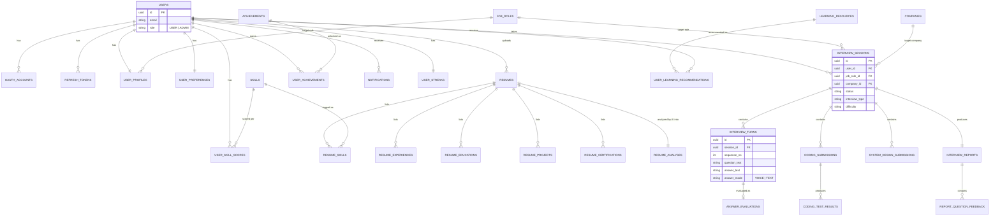

# InterviewIQ AI — Database Schema

PostgreSQL 16. All primary keys are UUIDs (`gen_random_uuid()`, via the
`pgcrypto` extension). Every table carries audit columns
(`created_at`, `updated_at`, `created_by`, `updated_by`) through a shared
convention — omitted from the ER diagram below for readability, but present
in every `CREATE TABLE` in §2.

## 1. Entity relationship diagram

Grouped by domain. Foreign keys cross domains where noted.



## 2. DDL by domain

### 2.1 Identity & Auth

```sql
create extension if not exists pgcrypto;

create table users (
    id                  uuid primary key default gen_random_uuid(),
    email               varchar(255) not null unique,
    password_hash       varchar(255),              -- null for OAuth-only accounts
    email_verified      boolean not null default false,
    role                varchar(20) not null default 'USER', -- USER | ADMIN
    status              varchar(20) not null default 'ACTIVE', -- ACTIVE | SUSPENDED | DELETED
    two_factor_enabled  boolean not null default false,
    two_factor_secret   varchar(255),
    created_at          timestamptz not null default now(),
    updated_at          timestamptz not null default now(),
    created_by          uuid,
    updated_by          uuid
);
create index idx_users_email on users (email);

create table oauth_accounts (
    id                  uuid primary key default gen_random_uuid(),
    user_id             uuid not null references users(id) on delete cascade,
    provider            varchar(30) not null,        -- GOOGLE
    provider_user_id    varchar(255) not null,
    created_at          timestamptz not null default now(),
    unique (provider, provider_user_id)
);
create index idx_oauth_user on oauth_accounts (user_id);

create table refresh_tokens (
    id                  uuid primary key default gen_random_uuid(),
    user_id             uuid not null references users(id) on delete cascade,
    token_hash          varchar(255) not null unique,
    device_label        varchar(255),
    ip_address          varchar(45),
    expires_at          timestamptz not null,
    revoked_at          timestamptz,
    created_at          timestamptz not null default now()
);
create index idx_refresh_user on refresh_tokens (user_id);

create table email_verification_tokens (
    id          uuid primary key default gen_random_uuid(),
    user_id     uuid not null references users(id) on delete cascade,
    token_hash  varchar(255) not null unique,
    expires_at  timestamptz not null,
    consumed_at timestamptz,
    created_at  timestamptz not null default now()
);

create table password_reset_tokens (
    id          uuid primary key default gen_random_uuid(),
    user_id     uuid not null references users(id) on delete cascade,
    token_hash  varchar(255) not null unique,
    expires_at  timestamptz not null,
    consumed_at timestamptz,
    created_at  timestamptz not null default now()
);
```

### 2.2 Taxonomy (job roles, companies, skills)

Created before any table that references it (profile, resume, interview
core all depend on this domain) so migration order has no forward references.

```sql
create table job_roles (
    id          uuid primary key default gen_random_uuid(),
    slug        varchar(100) not null unique,   -- java-backend, frontend, devops, ...
    name        varchar(255) not null,
    category    varchar(100)                    -- Engineering, Data, Security, ...
);

create table companies (
    id          uuid primary key default gen_random_uuid(),
    slug        varchar(100) not null unique,
    name        varchar(255) not null,
    logo_url    varchar(500)
);

create table skills (
    id          uuid primary key default gen_random_uuid(),
    slug        varchar(100) not null unique,
    name        varchar(255) not null,
    category    varchar(100)                    -- Language, Framework, Concept, Tool
);
```

> Named `job_roles`, not `roles` — `users.role` (§2.1) already means "auth
> role" (USER/ADMIN). Two different `role` concepts sharing one name is a
> guaranteed source of confusion in queries, DTOs, and Spring Security
> (`ROLE_ADMIN`) — keep them lexically distinct everywhere, including in
> Java class names (`JobRole` vs the auth `Role` enum).

### 2.3 Profile & preferences

```sql
create table user_profiles (
    user_id             uuid primary key references users(id) on delete cascade,
    full_name           varchar(255),
    headline            varchar(255),               -- e.g. "Backend Engineer, 3 YOE"
    avatar_url           varchar(500),
    experience_level     varchar(30),                -- INTERN | JUNIOR | MID | SENIOR | STAFF
    current_role         varchar(255),
    target_job_role_id   uuid references job_roles(id),
    github_url            varchar(500),
    linkedin_url           varchar(500),
    portfolio_url          varchar(500),
    bio                    text,
    is_public              boolean not null default false,
    updated_at              timestamptz not null default now()
);

create table user_preferences (
    user_id             uuid primary key references users(id) on delete cascade,
    theme               varchar(10) not null default 'SYSTEM', -- LIGHT | DARK | SYSTEM
    language            varchar(10) not null default 'en',
    email_notifications boolean not null default true,
    push_notifications  boolean not null default true,
    updated_at          timestamptz not null default now()
);
```

### 2.4 Resume module

```sql
create table resumes (
    id              uuid primary key default gen_random_uuid(),
    user_id         uuid not null references users(id) on delete cascade,
    file_url        varchar(500) not null,
    original_filename varchar(255) not null,
    is_active       boolean not null default true,
    parsed_at       timestamptz,
    created_at      timestamptz not null default now()
);
create index idx_resumes_user on resumes (user_id);

create table resume_skills (
    id          uuid primary key default gen_random_uuid(),
    resume_id   uuid not null references resumes(id) on delete cascade,
    skill_id    uuid references skills(id),
    raw_label   varchar(255) not null       -- as extracted, before mapping to canonical skill
);

create table resume_experiences (
    id          uuid primary key default gen_random_uuid(),
    resume_id   uuid not null references resumes(id) on delete cascade,
    company     varchar(255) not null,
    title       varchar(255) not null,
    start_date  date,
    end_date    date,
    description text
);

create table resume_educations (
    id           uuid primary key default gen_random_uuid(),
    resume_id    uuid not null references resumes(id) on delete cascade,
    institution  varchar(255) not null,
    degree       varchar(255),
    field_of_study varchar(255),
    start_date   date,
    end_date     date
);

create table resume_projects (
    id          uuid primary key default gen_random_uuid(),
    resume_id   uuid not null references resumes(id) on delete cascade,
    name        varchar(255) not null,
    description text,
    tech_stack  varchar(500),
    url         varchar(500)
);

create table resume_certifications (
    id          uuid primary key default gen_random_uuid(),
    resume_id   uuid not null references resumes(id) on delete cascade,
    name        varchar(255) not null,
    issuer      varchar(255),
    issued_date date
);

create table resume_analyses (
    id                  uuid primary key default gen_random_uuid(),
    resume_id           uuid not null unique references resumes(id) on delete cascade,
    resume_score        numeric(5,2) not null,
    ats_score            numeric(5,2) not null,
    missing_skills        jsonb not null default '[]',
    keyword_analysis       jsonb not null default '{}',
    grammar_suggestions     jsonb not null default '[]',
    improvement_suggestions jsonb not null default '[]',
    raw_ai_response          jsonb,
    created_at                timestamptz not null default now()
);
```

### 2.5 Interview core

```sql
create table interview_sessions (
    id                uuid primary key default gen_random_uuid(),
    user_id           uuid not null references users(id) on delete cascade,
    resume_id         uuid references resumes(id),
    job_role_id       uuid references job_roles(id),
    company_id        uuid references companies(id),
    interview_type    varchar(30) not null,   -- TECHNICAL | CODING | SYSTEM_DESIGN | HR | MIXED
    difficulty        varchar(20) not null,   -- EASY | MEDIUM | HARD
    language          varchar(30),            -- programming language, if applicable
    planned_duration_minutes int not null,
    status            varchar(20) not null default 'PENDING', -- PENDING | IN_PROGRESS | COMPLETED | ABANDONED
    started_at        timestamptz,
    completed_at      timestamptz,
    created_at        timestamptz not null default now()
);
create index idx_sessions_user on interview_sessions (user_id);
create index idx_sessions_status on interview_sessions (status);

create table interview_turns (
    id                uuid primary key default gen_random_uuid(),
    session_id        uuid not null references interview_sessions(id) on delete cascade,
    sequence_no       int not null,
    question_text     text not null,
    question_topic    varchar(255),
    answer_text       text,
    answer_mode       varchar(10),            -- VOICE | TEXT
    response_time_ms  int,
    filler_word_count int,
    speaking_wpm      numeric(6,2),
    asked_at          timestamptz not null default now(),
    answered_at       timestamptz,
    unique (session_id, sequence_no)
);
create index idx_turns_session on interview_turns (session_id);

create table answer_evaluations (
    id                    uuid primary key default gen_random_uuid(),
    turn_id               uuid not null unique references interview_turns(id) on delete cascade,
    technical_accuracy    numeric(5,2),
    confidence_score      numeric(5,2),
    communication_score   numeric(5,2),
    problem_solving_score numeric(5,2),
    depth_score           numeric(5,2),
    clarity_score         numeric(5,2),
    grammar_score         numeric(5,2),
    fluency_score         numeric(5,2),
    overall_score         numeric(5,2) not null,
    feedback              text,
    strengths             jsonb not null default '[]',
    weaknesses            jsonb not null default '[]',
    improvement_tips      jsonb not null default '[]',
    raw_ai_response       jsonb,
    created_at            timestamptz not null default now()
);
```

### 2.6 Coding & system design rounds

```sql
create table coding_submissions (
    id                uuid primary key default gen_random_uuid(),
    session_id        uuid not null references interview_sessions(id) on delete cascade,
    turn_id           uuid references interview_turns(id),
    language          varchar(30) not null,   -- JAVA | PYTHON | CPP | JAVASCRIPT
    source_code       text not null,
    complexity_analysis jsonb,                -- {"time":"O(n)","space":"O(1)"}
    ai_hints          jsonb default '[]',
    code_quality_score numeric(5,2),
    execution_time_ms  int,
    memory_used_kb      int,
    submitted_at         timestamptz not null default now()
);

create table coding_test_results (
    id              uuid primary key default gen_random_uuid(),
    submission_id   uuid not null references coding_submissions(id) on delete cascade,
    test_case_label varchar(100) not null,
    is_hidden       boolean not null default false,
    passed          boolean not null,
    actual_output    text,
    expected_output  text
);

create table system_design_submissions (
    id                    uuid primary key default gen_random_uuid(),
    session_id            uuid not null references interview_sessions(id) on delete cascade,
    turn_id               uuid references interview_turns(id),
    diagram_url            varchar(500),        -- uploaded image, or serialized whiteboard JSON
    diagram_data           jsonb,
    architecture_score      numeric(5,2),
    scalability_suggestions jsonb default '[]',
    ai_review               text,
    submitted_at             timestamptz not null default now()
);
```

### 2.7 Reporting

```sql
create table interview_reports (
    id                        uuid primary key default gen_random_uuid(),
    session_id                uuid not null unique references interview_sessions(id) on delete cascade,
    overall_score             numeric(5,2) not null,
    technical_score            numeric(5,2),
    communication_score          numeric(5,2),
    behavioral_score              numeric(5,2),
    confidence_score                numeric(5,2),
    company_readiness_score          numeric(5,2),
    success_probability_pct           numeric(5,2),
    ai_summary                         text,
    skill_gap_analysis                  jsonb default '[]',
    recommended_roadmap                  jsonb default '[]',
    pdf_url                                varchar(500),
    generated_at                            timestamptz not null default now()
);

create table report_question_feedback (
    id          uuid primary key default gen_random_uuid(),
    report_id   uuid not null references interview_reports(id) on delete cascade,
    turn_id     uuid not null references interview_turns(id),
    summary     text not null,
    score       numeric(5,2) not null
);
```

### 2.8 Gamification & analytics

```sql
create table user_skill_scores (
    user_id     uuid not null references users(id) on delete cascade,
    skill_id    uuid not null references skills(id) on delete cascade,
    score       numeric(5,2) not null default 0,
    sample_size int not null default 0,          -- number of evaluations contributing
    updated_at  timestamptz not null default now(),
    primary key (user_id, skill_id)
);

create table user_streaks (
    user_id             uuid primary key references users(id) on delete cascade,
    current_streak_days int not null default 0,
    longest_streak_days int not null default 0,
    last_activity_date  date,
    updated_at           timestamptz not null default now()
);

create table achievements (
    id          uuid primary key default gen_random_uuid(),
    slug        varchar(100) not null unique,
    name        varchar(255) not null,
    description varchar(500),
    icon        varchar(100),
    xp_reward   int not null default 0
);

create table user_achievements (
    user_id        uuid not null references users(id) on delete cascade,
    achievement_id uuid not null references achievements(id) on delete cascade,
    unlocked_at    timestamptz not null default now(),
    primary key (user_id, achievement_id)
);

create table user_xp (
    user_id     uuid primary key references users(id) on delete cascade,
    total_xp    bigint not null default 0,
    level       int not null default 1,
    updated_at  timestamptz not null default now()
);
```

*Leaderboard is a derived read (query against `user_xp` + `user_profiles`,
cached in Redis with short TTL) — not a stored table.*

### 2.9 Learning hub & notifications

```sql
create table learning_resources (
    id          uuid primary key default gen_random_uuid(),
    type        varchar(30) not null,   -- VIDEO | ARTICLE | COURSE | BOOK | LEETCODE | SYSTEM_DESIGN
    title       varchar(500) not null,
    url         varchar(500) not null,
    skill_id    uuid references skills(id),
    difficulty  varchar(20)
);

create table user_learning_recommendations (
    id            uuid primary key default gen_random_uuid(),
    user_id       uuid not null references users(id) on delete cascade,
    resource_id   uuid not null references learning_resources(id) on delete cascade,
    reason        varchar(500),          -- why AI recommended it (skill-gap driven)
    completed     boolean not null default false,
    recommended_at timestamptz not null default now()
);

create table notifications (
    id          uuid primary key default gen_random_uuid(),
    user_id     uuid not null references users(id) on delete cascade,
    type        varchar(50) not null,
    title       varchar(255) not null,
    body        varchar(1000),
    read_at     timestamptz,
    created_at  timestamptz not null default now()
);
create index idx_notifications_user on notifications (user_id, read_at);
```

### 2.10 Admin

```sql
create table feature_flags (
    key         varchar(100) primary key,
    enabled     boolean not null default false,
    description varchar(500),
    updated_at  timestamptz not null default now()
);

create table api_usage_logs (
    id              uuid primary key default gen_random_uuid(),
    user_id         uuid references users(id),
    provider        varchar(30) not null,   -- OPENAI | GEMINI
    endpoint        varchar(255),
    tokens_input    int,
    tokens_output   int,
    cost_usd        numeric(10,4),
    latency_ms      int,
    created_at      timestamptz not null default now()
);
create index idx_api_usage_user on api_usage_logs (user_id, created_at);

create table system_logs (
    id          uuid primary key default gen_random_uuid(),
    level       varchar(10) not null,
    logger      varchar(255),
    message     text,
    metadata    jsonb,
    created_at  timestamptz not null default now()
);
```

## 3. Indexing strategy

- Every FK column has a supporting index (explicit above where not implied
  by uniqueness).
- `interview_sessions(user_id, status)` and `interview_turns(session_id,
  sequence_no)` are the hottest read paths (dashboard + live session) —
  covered.
- `jsonb` columns (`skill_gap_analysis`, `missing_skills`, etc.) are
  read-mostly, rendered wholesale by the frontend — no GIN indexes needed
  unless we later add server-side filtering on their contents.
- Full-text search on resumes/questions is out of scope for v1; revisit
  with `pg_trgm` if the Learning Hub needs fuzzy resource search.

## 4. Migration tooling

Flyway, versioned migrations under
`backend/src/main/resources/db/migration/V{n}__{description}.sql`. The SQL
above is written to drop in directly, one migration per subsection in the
order given (§2.1 `V1__auth`, §2.2 `V2__taxonomy`, §2.3 `V3__profile`, §2.4
`V4__resume`, §2.5 `V5__interview_core`, §2.6 `V6__coding_and_system_design`,
§2.7 `V7__reporting`, §2.8 `V8__gamification`, §2.9 `V9__learning_and_notifications`,
§2.10 `V10__admin`) during Phase 2. The order above is migration order, not
incidental — each migration only references tables created in the same or
an earlier one.
